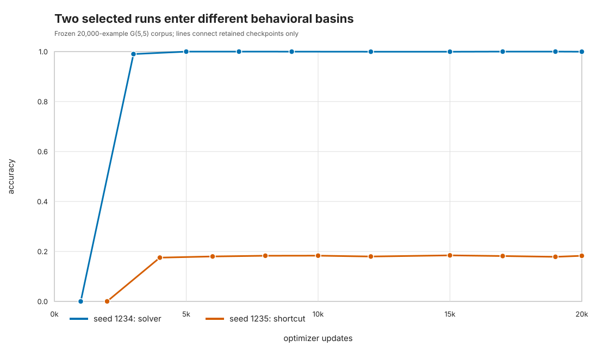
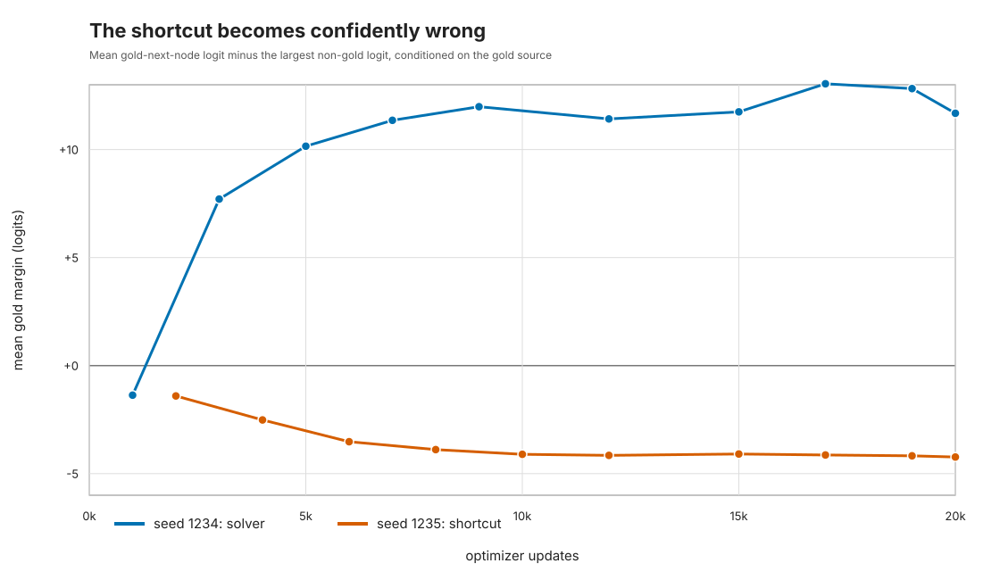
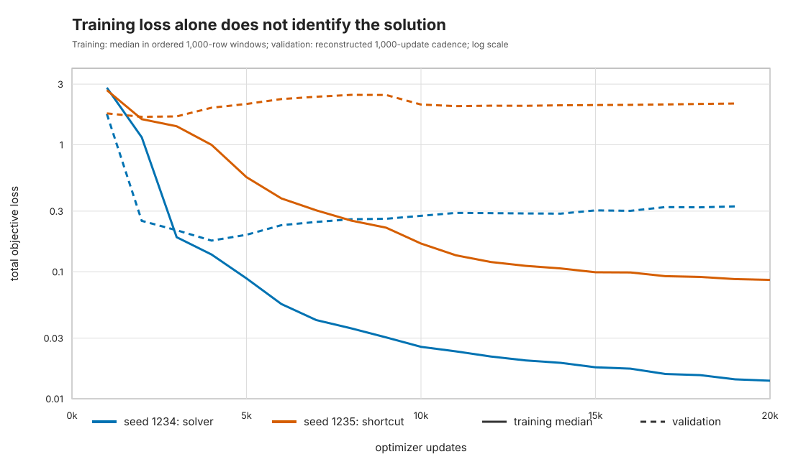

# Loss keeps falling, but the planner has already chosen a shortcut

*A retrospective two-trajectory case study of NextLat on Path-Star*

Transformers can fail at a task for at least two very different reasons. They may simply need
more optimization, or they may have learned a different rule—one that fits the training stream
without generalizing to the intended problem. Those explanations suggest opposite responses.
The first says “train longer.” The second says that more of the same training may only strengthen
the wrong behavior.

We found a compact example of the second pattern while reproducing NextLat on Path-Star.

[Path-Star](https://arxiv.org/abs/2410.13779) is a synthetic graph task designed to expose a
failure mode of standard autoregressive training. A model receives a serialized star-like graph
and two nodes, then must output the unique five-node path between them. The endpoints are easy to
copy. The three interior nodes require selecting and following the correct arm. [NextLat](https://arxiv.org/abs/2511.05963)
augments next-token prediction with a next-latent objective and reports strong Path-Star results.

In our reproduction, one saved run generalized nearly perfectly and another settled near 18%
exact-path accuracy. We already knew those final outcomes. The question for this retrospective
analysis was narrower: when did the two trajectories become behaviorally different, and did the
failed run look merely slow or qualitatively stuck?

## What we measured

We evaluated every retained ordinary checkpoint from the two runs on the same frozen set of
20,000 G(5,5) graphs. Both runs used the pinned public
[NextLat implementation](https://github.com/JaydenTeoh/NextLat), the same model and objective,
the same train and test corpora, effective batch size 512, the same optimizer and update budget,
and compilation disabled. They differed in seed. Checkpoint schedules were historical and not
identical, so all plots use actual update counts rather than pretending the observations were
paired.

Evaluation was standardized on one full-host RTX 4090 with one visible GPU, no distributed
sampler, deterministic inference settings, and explicit greedy decoding. A repeated final
evaluation produced byte-identical scientific JSON. No new training was performed.

The primary measurement was exact five-token path accuracy. We also measured the first
nontrivial branch decision while conditioning on the correct source node. For that decision, the
most revealing quantity was the gold-token margin: the correct next-node logit minus the largest
incorrect logit.

The generalizing run, seed 1234, goes from zero exact paths at update 1,000 to 99.015% at update
3,000. The retained checkpoints therefore bound its transition as (1,000, 3,000]. An archived
in-training validation trace suggests that the transition had occurred by update 2,000, but we
keep the more conservative frozen-evaluator bound as the primary statement.

The shortcut run, seed 1235, reaches 17.525% at update 4,000 and then stays in a narrow
17.525–18.430% band through update 20,000. At the final checkpoint it gets the source token right
99.995% of the time and the destination token right 93.600% of the time, while its three interior
positions remain around 18–19%.

That pattern is not what “almost learned the path algorithm” looks like. It is consistent with a
solution that captures easy boundary and serialization regularities without learning the general
path rule.

## The failed run becomes more confident, not less

The branch margin separates the two trajectories even more clearly. Seed 1234 moves from a mean
margin of −1.368 logits at update 1,000 to +7.709 at update 3,000 and +11.680 at update 20,000.
Seed 1235 moves in the other direction: −1.405 at update 2,000, −2.515 at update 4,000, and
−4.232 at update 20,000.

In other words, the shortcut run is not waiting near an uncertain boundary. On average, it becomes
increasingly confident in the wrong next edge.

Meanwhile, training loss continues to fall for both runs. The failed run’s median total training
loss drops from 1.589 in the second 1,000-update window to 0.086 in the final window. Its held-out
behavior has long since plateaued.

This is the practical lesson from the case study: on Path-Star, loss-only monitoring can mistake
consolidation of a shortcut for progress toward planning. A small held-out behavioral probe and a
decision margin expose the distinction by the first few thousand updates.

## What this does—and does not—say about reproducibility

Earlier diagnostics in this project found genuine numerical sensitivity. Two nominally identical
two-GPU jobs matched in initial weights, first batches, and recorded sampler permutations but
diverged later. Their first measurable difference was a tiny CUDA embedding-gradient difference.
Deterministic CUDA settings removed that first-step difference, yet deterministic training still
did not guarantee the generalizing solution. GPU count, sampler seed, compilation, and
deterministic algorithms each changed execution, but no one factor explained the public-versus-paper
gap.

That supports a picture in which unstable optimization amplifies small perturbations. It does not
show that the specific numerical difference caused the contrast between the two seeds plotted
here, and it does not reconstruct the authors’ private execution environment.

There is also a small evaluator discrepancy worth recording. The original frozen evaluator scored
the failed final checkpoint at 3,663/20,000 (18.315%); the newly standardized evaluator scores the
same checkpoint at 3,651/20,000 (18.255%). The 12-example difference does not affect the
interpretation, but we did not identify its exact source, so the values remain explicitly separate.

Most importantly, these are two runs chosen after their outcomes were known. The 20,000 test
graphs make each checkpoint measurement precise; they do not create 20,000 independent training
runs. This case study cannot estimate NextLat’s solver probability, compare NextLat to other
objectives, or show that the paper’s successful runs did not occur.

## The experiment this result motivates

The best next use of these checkpoints is the project’s original second hypothesis: does the
generalizing transition coincide with a representation that is selectively sensitive to the
future?

The [future-sensitive geometry pilot](FUTURE_SENSITIVE_GEOMETRY_PILOT.md) starts from untouched
base graphs and creates four exactly verified, tightly matched variants: edge reserialization,
an off-path edit that preserves the correct future, an edit that changes the immediate next node,
and an edit that preserves that next node but changes a later path token. The primary contrast asks
whether the branch-state representation moves farther for a delayed future-changing edit than for
a visually matched future-preserving edit.

The archived checkpoints make the time course informative without new training. The key pattern
would be absent before seed 1234's transition, present after it, and absent in seed 1235's shortcut
state. If that geometry gate passes, controlled activation patching tests whether the altered state
is locally sufficient to move the later decision toward the donor future. Serialization-only,
future-preserving, unrelated-donor, self-patch, and norm-matched random controls guard against
generic perturbation effects.

This remains conditional on two selected trajectories, but it directly tests an original project
hypothesis and links behavior, representation, and a causal manipulation. A checkpoint-rescue
study could follow later if training interventions become the priority.

For now, the narrow result is still useful: one selected run undergoes a rapid behavioral phase
transition, while another settles into a confidently wrong shortcut despite steadily improving
training loss. The complete [technical report](BASIN_CASE_STUDY.md),
[machine-readable summary](../results/studies/basin_case_study/retrospective-2026-08-27/summary.json),
tables, deterministic figure builder, and frozen artifact hashes are included in the repository.
The new evaluation cost about $0.38 and performed no new training.
